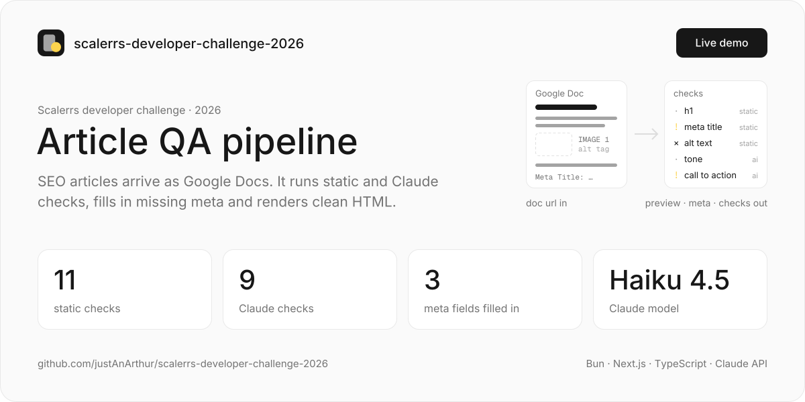
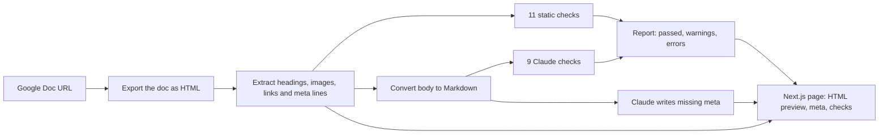

<a href="https://scalerrs-developer-challenge-2026.vercel.app"></a>

# Scalerrs article QA

Article quality pipeline for an SEO agency: paste a Google Doc URL, get static and AI-powered checks, generated meta
and a clean HTML preview. Built for the Scalerrs developer challenge in May 2026.

> Finished and archived.

**[Live demo →](https://scalerrs-developer-challenge-2026.vercel.app)** · **[Loom walkthrough →](https://www.loom.com/share/b3c41211487d40c5b5289815d43401f0)**

## What it does

- Fetches the Google Doc through its HTML export and pulls out the h1, heading levels, word count, images, links and
  any `Meta Title:`, `Meta Description:` or `Meta Keywords:` lines
- Turns `IMAGE 1 … alt tag: "…"` paragraphs into real `` tags, so the preview shows them
- Runs 11 static checks: a single h1, no skipped heading levels, meta title 50–60 chars, meta description 120–160 chars,
  3–10 keywords, 300–5,000 words, about one image per 300 words, alt text on every image, images reachable (Google
  login walls included), no duplicate links, no broken links
- Runs 9 AI checks with Claude Haiku 4.5 on the article as Markdown: logical structure, lexical quality, repetition,
  sentence length, section transitions, keyword stuffing, call to action, tone, product link balance
- Generates missing meta with Claude; fields written in the doc win, and each field is labelled `from doc` or
  `ai generated` in the UI

## How it works



1. fetches a Google Doc as HTML
2. extracts headings, images, links, meta fields
3. runs static checks (heading structure, meta length, broken links, image alt text, etc.)
4. runs AI checks via Claude (structure, tone, keyword stuffing, CTA, etc.)
5. generates missing meta with AI, respecting any fields already defined in the doc

Static checks, AI checks and meta generation run in parallel. The Next.js app calls all of it from one server action.

## Run

```sh
bun install
```

Set up env vars in `apps/demo/.env`:

```
ANTHROPIC_API_KEY=...
```

Run the UI:

```sh
cd apps/demo
bun dev    # http://localhost:3000
```

## Structure

```
packages/core   - parsing, checks, meta generation (framework-agnostic)
apps/demo       - next.js ui
```

[`packages/core`](packages/core/README.md) can be used on its own: `extractFromHtml`, `runChecks`, `buildMeta` and
`toMarkdown`.

## Stack

TypeScript on Bun workspaces. `@scalerrs/core` uses node-html-parser and Turndown, and calls the Anthropic Messages
API (`claude-haiku-4-5`) with `fetch`. The demo is Next.js 16 with React 19 and Tailwind CSS 4.

## Ideas for the future

- Internal link suggestions
  - Generate embeddings of all published articles and find the closest matches for each new one. Instead of guessing
    what to link to, the system tells you.
- Image hosting
  - Automatically compress and re-upload images to a permanent host (R2, S3, Cloudinary, Next.js) so you're not
    shipping Google Drive links to production.
- Richer meta
  - Extend beyond title/description/keywords to OG image generation, JSON-LD schema (article, FAQ, how-to), and Twitter
    card tags. Most of this can be derived from what's already extracted.
- Batch mode
  - Process a list of Google Doc URLs in one go, run all checks in parallel, and send a summary notification (Slack,
    email) when everything's done or when something fails.
- CMS integration
  - Direct publish to WordPress or Shopify with all meta prefilled. The HTML is already clean and the meta is already
    generated - it's mostly just a matter of hooking into the API.

## License

[CC BY-NC-ND 4.0](LICENSE): share it with credit, but no changes and no commercial use. Don't hand it in as your own
challenge submission.
